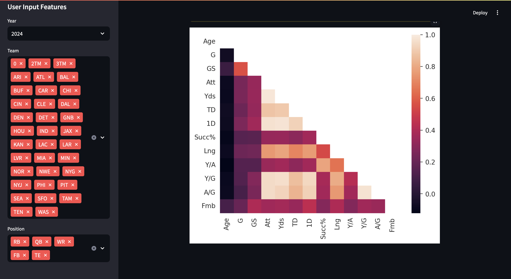

# NFL Player Stats Explorer

This project is a web application built with Streamlit that allows users to explore NFL player statistics. The app scrapes data from Pro-Football-Reference.com and provides various features to filter and visualize the data.





## Features

- **Web Scraping**: Automatically fetches NFL player stats data from Pro-Football-Reference.com.
- **Data Filtering**: Users can filter player stats by team and position.
- **Data Visualization**: Displays player stats in a table and provides an option to generate an intercorrelation heatmap.
- **CSV Download**: Allows users to download the filtered player stats as a CSV file.

## Technologies Used

- **Python Libraries**: 
  - `streamlit`
  - `pandas`
  - `seaborn`
  - `matplotlib`
  - `numpy`
  - `base64`

## How to Run

1. Clone the repository.
2. Install the required Python libraries:
   ```sh
   pip install streamlit pandas seaborn matplotlib numpy
   ```
3. Run the Streamlit app:
	```sh
	streamlit run nfl_stats_app.py
	```

## Usage

- Select the year from the sidebar to load the player stats for that year.
- Filter the data by selecting teams and positions from the sidebar.
- View the filtered player stats in a table.
- Download the filtered data as a CSV file.
- Generate and view an intercorrelation heatmap of the numerical data.

## Data Source

The data is sourced from [Pro-Football-Reference.com](https://www.pro-football-reference.com/).

## License

This project is licensed under the MIT License.